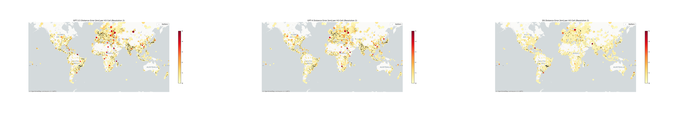
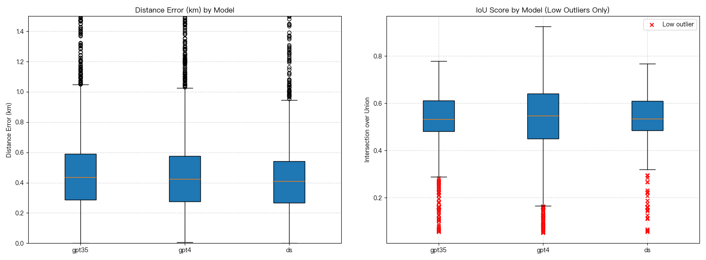

# Exploring Spatial Bias in LLM-based Geocoding

An exploratory geospatial AI course project that evaluates how consistently large language models convert place descriptions into coordinates and bounding boxes across the world.

The project was completed at the **Technical University of Munich (TUM)** for *Mapping for a Sustainable World*. It combines global POI sampling, reference geocoding, LLM inference, spatial accuracy metrics, H3 aggregation, and map-based analysis.



## What I built

- Constructed a geographically distributed POI sample from GeoNames and OpenStreetMap data.
- Generated reference coordinates and bounding boxes with Nominatim and administrative boundaries from GADM.
- Queried GPT-3.5, GPT-4, and DeepSeek for structured geocoding predictions.
- Evaluated point predictions with Haversine distance and bounding boxes with intersection over union (IoU).
- Aggregated errors into H3 cells to inspect geographic variation and created global comparison maps.
- Developed the workflow in Python with pandas, GeoPandas, Shapely, H3, Matplotlib, and web APIs.

## Dataset and course-run results

The sampling pipeline targeted 5,000 POIs. After reference geocoding and validation, the completed course run contained **4,590 evaluable locations**.

| Model | Median distance error | Mean distance error | Median IoU |
|---|---:|---:|---:|
| GPT-3.5 | 0.538 km | 35.246 km | 0.499 |
| GPT-4 | 0.536 km | 26.437 km | 0.478 |
| DeepSeek | 0.425 km | 11.096 km | 0.532 |

The gap between the medians and means reflects a small number of very large geocoding errors. These values describe the historical course run and should not be interpreted as a current model leaderboard.



## Evaluation note

The original course experiment supplied each model with a rounded version of the reference bounding box. This made the experiment useful for exploring spatial output behavior, but it also gave the models information derived from the target answer. The historical results are therefore **reference-bbox-assisted**, not a blind geocoding benchmark.

The cleaned public pipeline in this repository removes that information from the prompt. It asks each model to geocode from the address alone, keeps the reference data outside the inference stage, and calculates metrics only after predictions have been saved. A new blind run is required before making comparative performance claims from the revised pipeline.

The original IoU implementation also created or expanded small boxes in degree space. The public implementation uses the available reference and predicted boxes directly and calculates their spherical surface areas. This changes the metric definition, so revised IoU values are not directly comparable with the historical figures.

## Repository structure

```text
.
├── data/
│   ├── README.md
│   └── course_run_results.csv
├── figures/
├── src/
│   ├── query_models.py
│   ├── compute_metrics.py
│   └── plot_results.py
├── .env.example
├── .gitignore
└── requirements.txt
```

The 2.6 GB GADM GeoPackage, the GeoNames source dump, API credentials, caches, and IDE files are intentionally excluded. Download links and provenance notes are provided in [`data/README.md`](data/README.md).

## Reproduce the cleaned evaluation

Create an environment and install the dependencies:

```bash
python -m venv .venv
source .venv/bin/activate
pip install -r requirements.txt
```

Prepare a CSV with at least an `address` column. Reference coordinates and boxes can remain in the same file; `query_models.py` sends only the address to the model.

Copy `.env.example` to `.env`, add your own keys, and run one or more configured models:

```bash
python src/query_models.py \
  --input data/your_reference_data.csv \
  --output data/blind_predictions.csv \
  --models gpt-4 deepseek-chat
```

Then calculate the metrics and generate summary plots:

```bash
python src/compute_metrics.py \
  --input data/blind_predictions.csv \
  --output data/blind_results.csv

python src/plot_results.py \
  --input data/blind_results.csv \
  --output-dir figures/blind_run
```

No API call is made unless `query_models.py` is run explicitly.

## Data sources

- [GeoNames geographical database](https://download.geonames.org/export/dump/)
- [OpenStreetMap](https://www.openstreetmap.org/) POIs through the Overpass API
- [Nominatim](https://nominatim.org/) reference geocoding
- [GADM administrative boundaries](https://gadm.org/data.html)

Please follow each provider's licence, attribution, and usage policy when reproducing the workflow.

## Skills demonstrated

Python · geospatial data processing · LLM evaluation · prompt and experiment design · API integration · GeoPandas · Shapely · H3 · spatial metrics · data visualization · reproducible research

## Author

**Yi Zhao**  
M.Sc. Geodesy and Geoinformation, Technical University of Munich
