# Exploring Spatial Bias in LLM-based Geocoding

An exploratory geospatial AI course project that evaluates how consistently large language models convert place descriptions into coordinates and bounding boxes across the world.

The project was completed at the **Technical University of Munich (TUM)** for *Mapping for a Sustainable World*. It combines global POI sampling, reference geocoding, LLM inference, spatial accuracy metrics, H3 aggregation, and map-based analysis.

## Project workflow

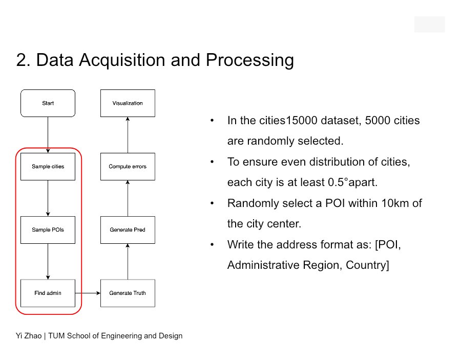

The final course presentation organized the work into five stages:

1. **Global sampling.** The design targeted 5,000 cities from GeoNames `cities15000`, aimed to keep sampled cities geographically separated, and selected one OpenStreetMap POI within 10 km of each city centre. Each query used the form `[POI, Administrative Region, Country]`.
2. **Reference generation.** Nominatim supplied reference coordinates and POI bounding boxes. GADM supplied country and administrative-region boundaries.
3. **LLM geocoding.** GPT-3.5, GPT-4, and DeepSeek R1 returned a point and a bounding box for each place description.
4. **Error analysis.** Haversine distance measured point-location error. Intersection over Union (IoU) measured bounding-box overlap.
5. **Spatial aggregation.** H3 resolution 2 cells grouped the observations so regional error patterns could be compared on global maps.

I implemented this workflow in Python using pandas, GeoPandas, Shapely, H3, Matplotlib, Nominatim, Overpass, and model APIs.

## H3 aggregation

The analysis assigned each reference coordinate to an H3 resolution 2 cell and averaged the observations within each populated cell. This reduced thousands of individual points to a common global spatial index for comparing regional patterns.

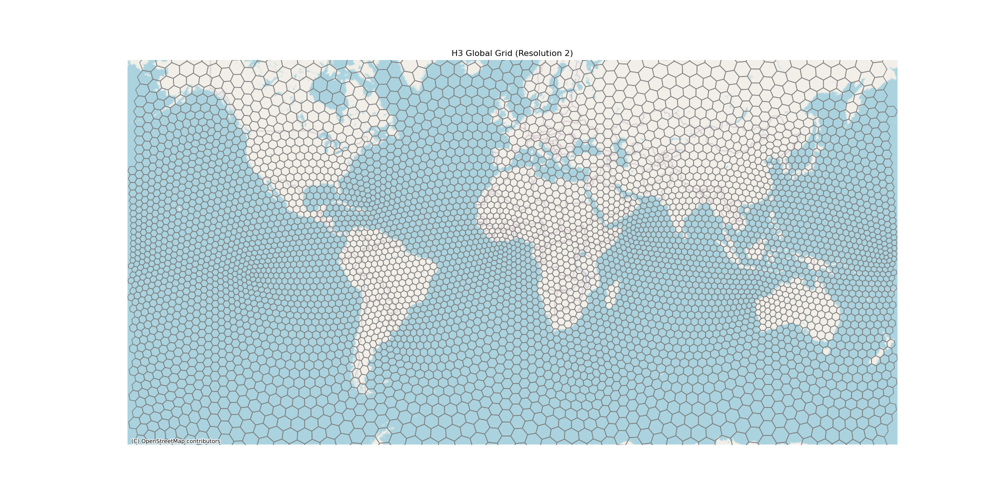

## Course-run results

The sampling pipeline targeted 5,000 POIs. After reference geocoding and validation, the completed course run contained **4,590 evaluable locations**.

| Model | Median distance error | Mean distance error | Median IoU |
|---|---:|---:|---:|
| GPT-3.5 | 0.538 km | 35.246 km | 0.499 |
| GPT-4 | 0.536 km | 26.437 km | 0.478 |
| DeepSeek R1* | 0.425 km | 11.096 km | 0.532 |

The gap between the medians and means reflects a small number of very large geocoding errors. These values describe the historical course run and should not be interpreted as a current model leaderboard.

### Point-distance error

The course presentation compared the mean Haversine distance error in every populated H3 cell. The maps use a shared 0–5 km colour range; black points mark values outside the displayed range.

#### GPT-3.5


#### GPT-4

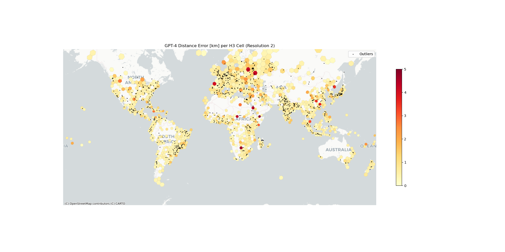

#### DeepSeek R1

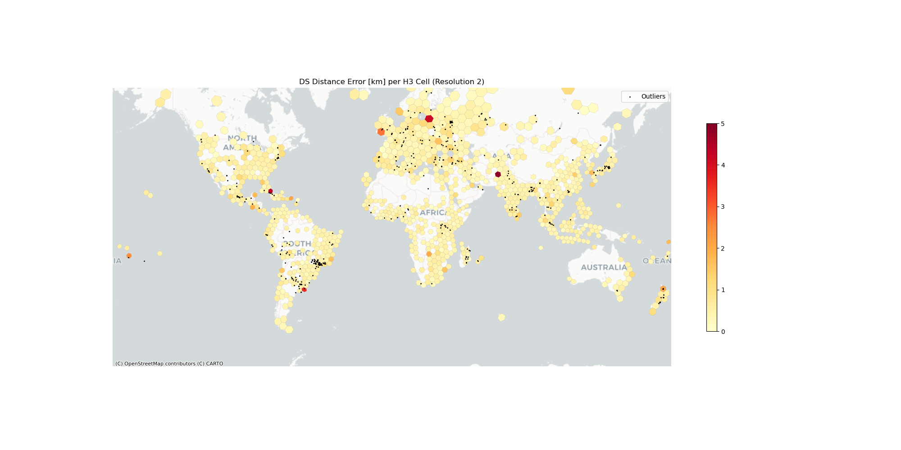

The box plot makes the central distributions easier to compare. It displays the lower error range used in the final presentation, while the summary table above retains the full-data means and medians.

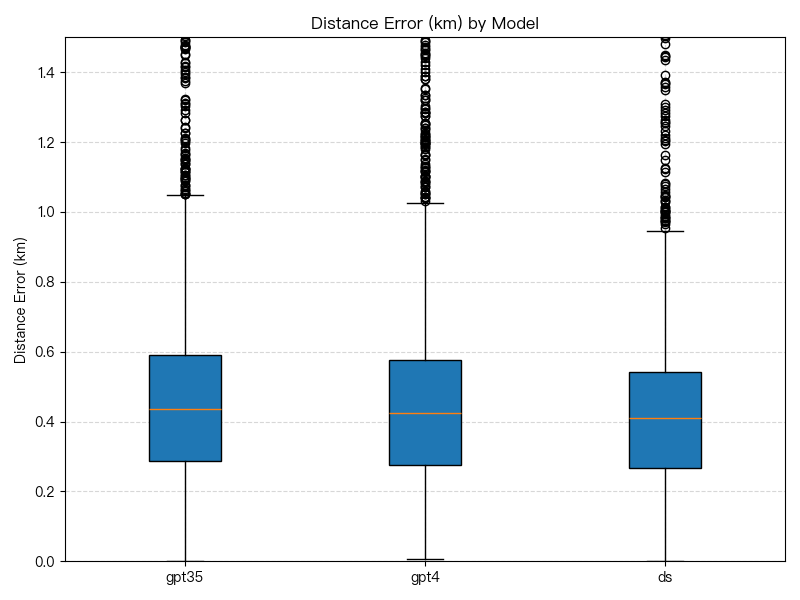

### Bounding-box overlap

The IoU maps show how closely the model-generated bounding boxes overlapped the reference boxes after H3 aggregation. Higher values indicate greater overlap.

#### GPT-3.5

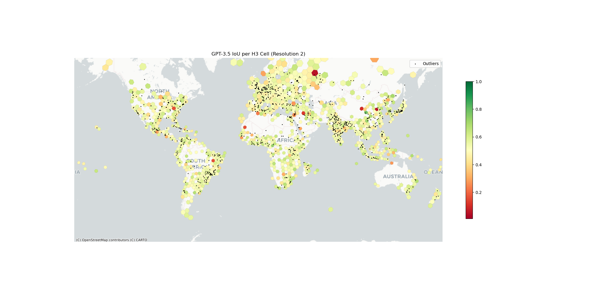

#### GPT-4

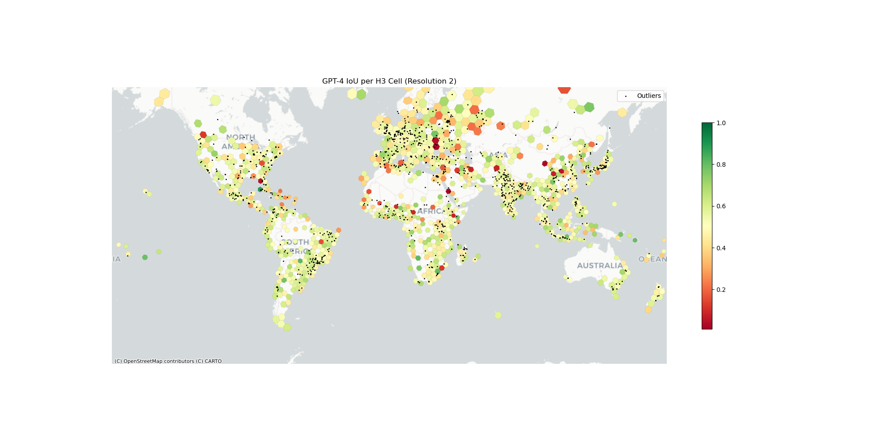

#### DeepSeek R1

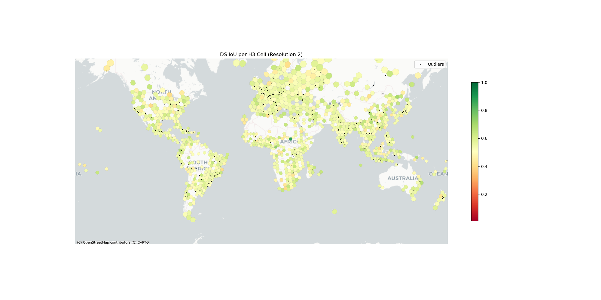

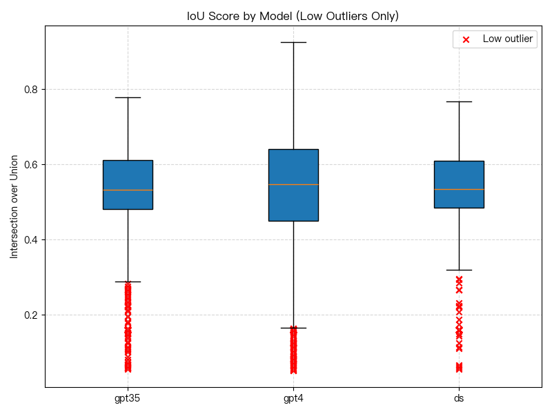

### Bounding-box case studies

The final presentation used individual POIs to show why IoU is more difficult to interpret than point distance. Different models may identify the correct place while using different spatial extents. Small reference boxes, duplicated POI names, and different definitions of a place boundary can all reduce IoU.

| Times Square, New York | Eiffel Tower, Paris |
|---|---|
| 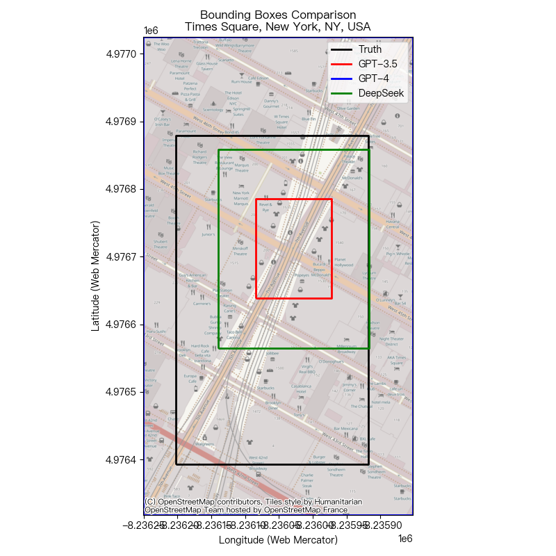 | 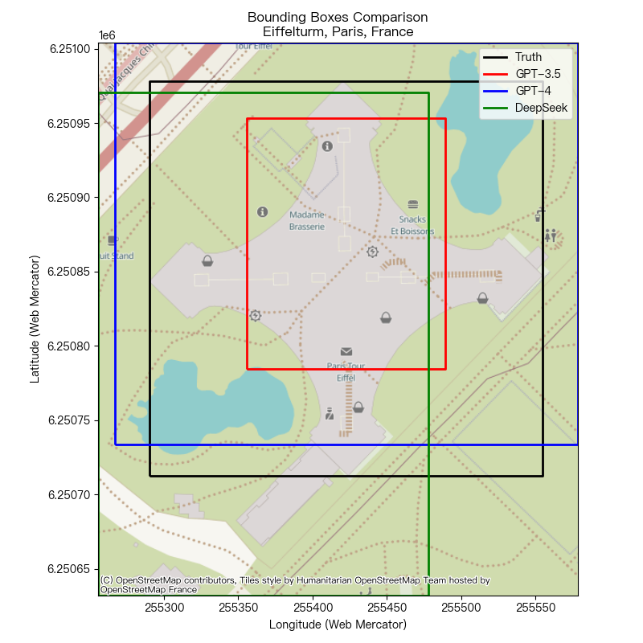 |

The Googleplex example shows a larger disagreement in both position and extent:

<p align="center">
  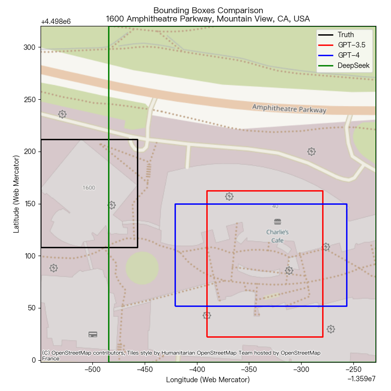
</p>

### Interpretation in the final presentation

The course presentation reported three main observations:

- The historical DeepSeek R1 results had the lowest distance errors and the highest median IoU among the three recorded outputs.
- Coordinate predictions were generally more stable than bounding-box predictions.
- Error patterns varied geographically, with lower errors appearing more often in densely represented regions.

The discussion also identified limitations in the underlying data: GeoNames does not represent all cities uniformly, locations that failed reference geocoding were excluded, and sparse local data can itself create geographic imbalance. The evaluation and model-provenance notes below add further limitations found while preparing this public repository.

### DeepSeek R1 model provenance

The experiment was designed and reported as an evaluation of **DeepSeek R1**. At the time of the July 2025 run, DeepSeek's official change log identified the `deepseek-reasoner` endpoint as **DeepSeek-R1-0528**. This is therefore the intended R1 version for the study.

The original implementation nevertheless requested `deepseek-chat` first and used `deepseek-reasoner` only if that request failed. At that time, `deepseek-chat` corresponded to DeepSeek-V3-0324. Because the saved CSV does not contain the endpoint used for each row, the historical outputs cannot provide row-level confirmation that every response came from R1. The asterisk in the results table records this provenance limitation.

The cleaned pipeline avoids this ambiguity. `DEEPSEEK_MODEL` in `.env` must specify the API model, and the exact identifier is saved in every output row. See the official [DeepSeek API change log](https://api-docs.deepseek.com/updates/) for the models associated with each API alias at a given date.

## Evaluation note

The original course experiment included the reference bounding-box coordinates in each model prompt after rounding every coordinate to two decimal places. This made the experiment useful for exploring spatial output behavior, but it also gave the models approximate location information derived from the target answer. The historical results are therefore **reference-bbox-assisted**, not a blind geocoding benchmark.

The cleaned public pipeline in this repository removes that information from the prompt. It asks each model to geocode from the address alone, keeps the reference data outside the inference stage, and calculates metrics only after predictions have been saved. A new blind run is required before making comparative performance claims from the revised pipeline.

The original IoU implementation also created or expanded small boxes in degree space. The public implementation uses the available reference and predicted boxes directly and calculates their spherical surface areas. This changes the metric definition, so revised IoU values are not directly comparable with the historical figures.

## Repository structure

```text
.
├── data/
│   ├── README.md
│   └── course_run_results.csv
├── figures/
├── src/
│   ├── query_models.py
│   ├── compute_metrics.py
│   └── plot_results.py
├── .env.example
├── .gitignore
└── requirements.txt
```

## Files intentionally not included

| Original material | Why it is excluded | How to obtain or reproduce it |
|---|---|---|
| `gadm_410.gpkg` (approximately 2.6 GB) | Too large for a normal GitHub repository and distributed by an external data provider | Download the required administrative boundaries from [GADM](https://gadm.org/data.html) |
| `cities15000.txt` | Upstream GeoNames source data should remain linked to its provider | Download it from the [GeoNames export directory](https://download.geonames.org/export/dump/) |
| `sampled_pois.csv`, `sampled_pois_with_truth.csv`, and `sampled_pois_with_preds.csv` | Intermediate files duplicate information contained in the final course-run results | Regenerate them from the sampling, reference-geocoding, and inference stages |
| Original prototype scripts | Replaced by the smaller public pipeline because the course versions contained duplicated experiments, ambiguous model fallback behavior, and reference information in the inference prompt | Use the cleaned scripts under `src/` |
| `.idea/`, `__pycache__/`, `.DS_Store`, `Project.zip`, and exploratory test plots | Local development state, caches, duplicated files, and debugging artifacts | Not required to reproduce the public workflow |
| API credentials and `.env` | Private secrets must never be committed | Copy `.env.example` to `.env` and provide your own credentials locally |
| Course report and presentation files | Retained as local academic deliverables; the repository summarizes their methods and results in a web-readable form | Available from the author on request |

Additional data provenance notes are provided in [`data/README.md`](data/README.md).

## Reproduce the cleaned evaluation

Create an environment and install the dependencies:

```bash
python -m venv .venv
source .venv/bin/activate
pip install -r requirements.txt
```

Prepare a CSV with at least an `address` column. Reference coordinates and boxes can remain in the same file; `query_models.py` sends only the address to the model.

Copy `.env.example` to `.env`, add your own keys, and run one or more configured models:

```bash
python src/query_models.py \
  --input data/your_reference_data.csv \
  --output data/blind_predictions.csv \
  --models gpt-4 deepseek
```

Then calculate the metrics and generate summary plots:

```bash
python src/compute_metrics.py \
  --input data/blind_predictions.csv \
  --output data/blind_results.csv

python src/plot_results.py \
  --input data/blind_results.csv \
  --output-dir figures/blind_run
```

No API call is made unless `query_models.py` is run explicitly.

## Data sources

- [GeoNames geographical database](https://download.geonames.org/export/dump/)
- [OpenStreetMap](https://www.openstreetmap.org/) POIs through the Overpass API
- [Nominatim](https://nominatim.org/) reference geocoding
- [GADM administrative boundaries](https://gadm.org/data.html)

Please follow each provider's licence, attribution, and usage policy when reproducing the workflow.

## Skills demonstrated

Python · geospatial data processing · LLM evaluation · prompt and experiment design · API integration · GeoPandas · Shapely · H3 · spatial metrics · data visualization · reproducible research

## Author

**Yi Zhao**  
M.Sc. Geodesy and Geoinformation, Technical University of Munich
